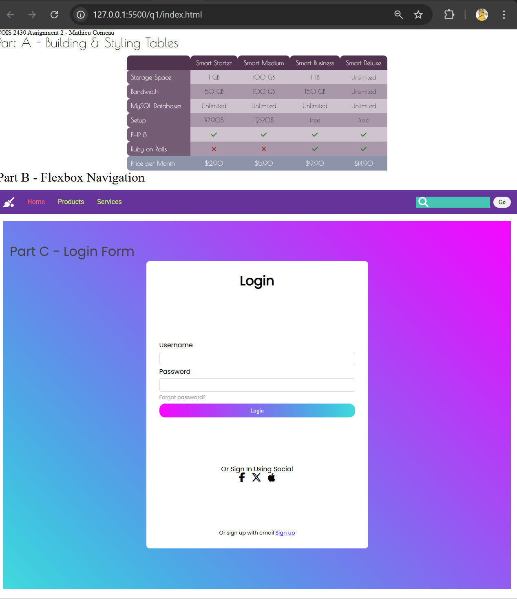
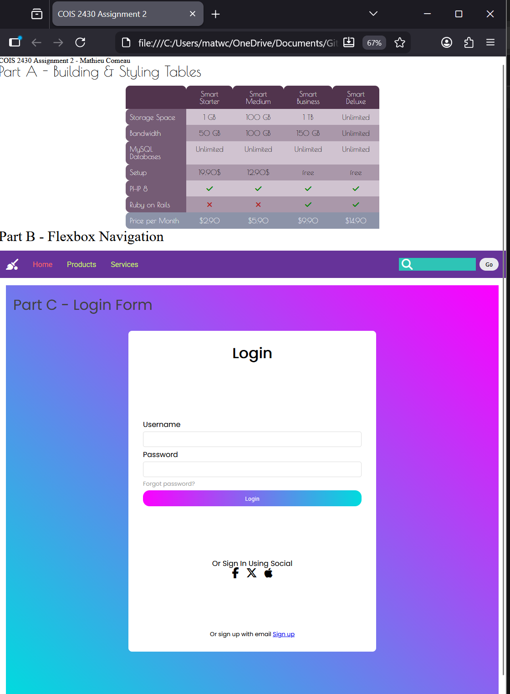
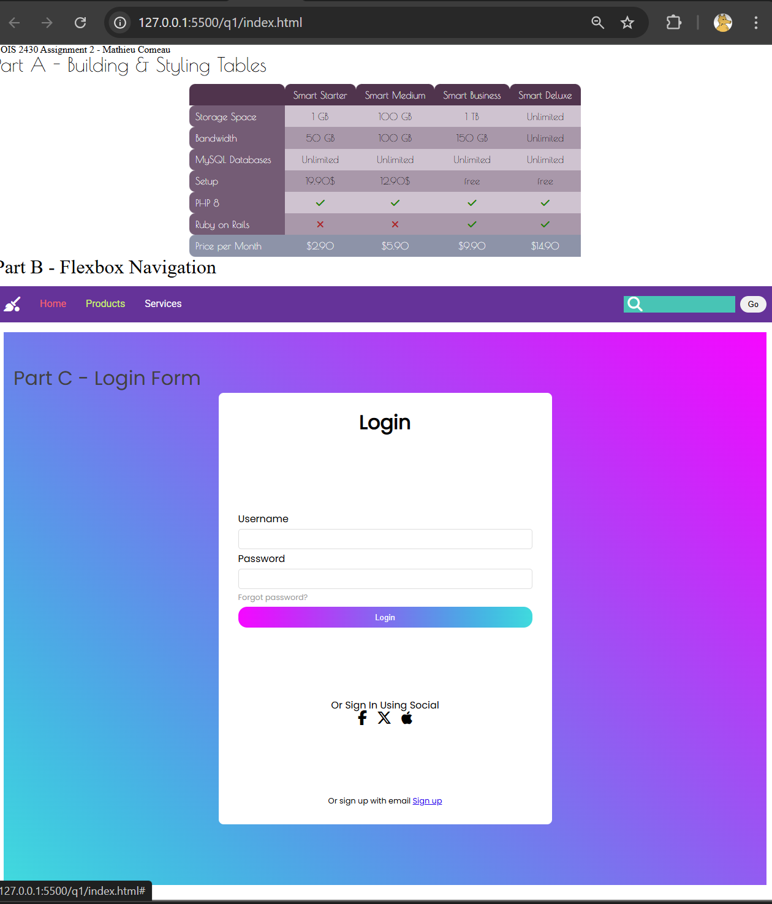
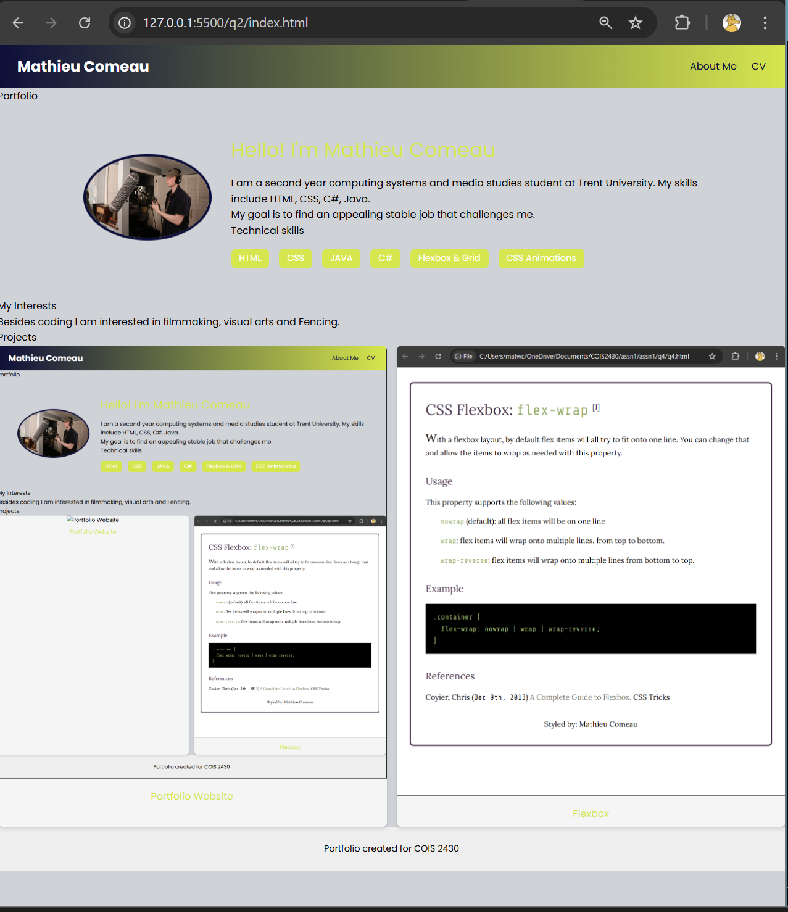
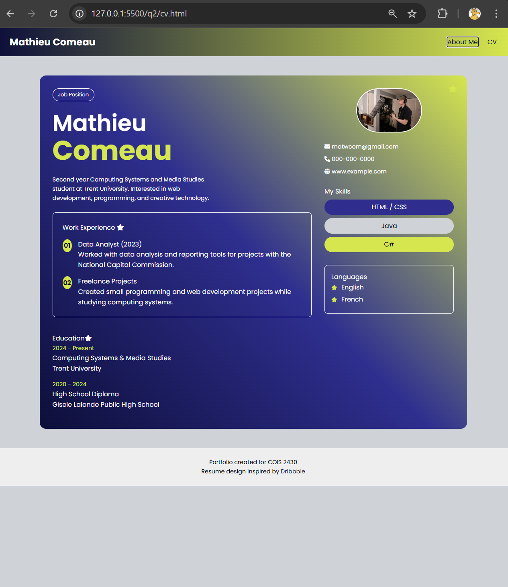
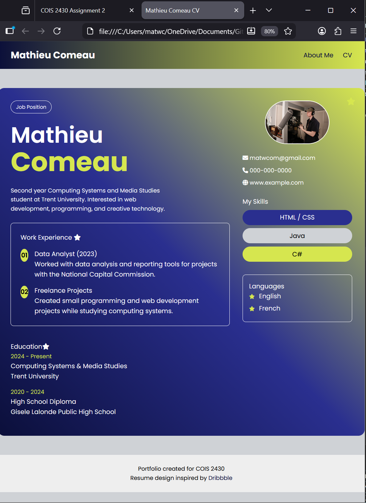
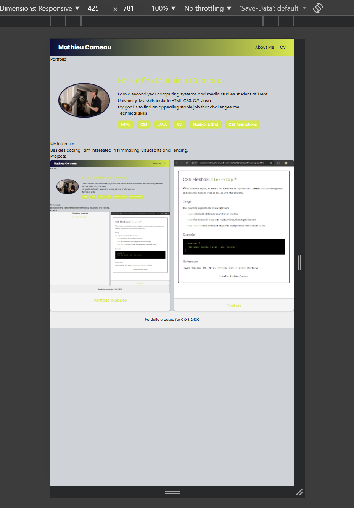
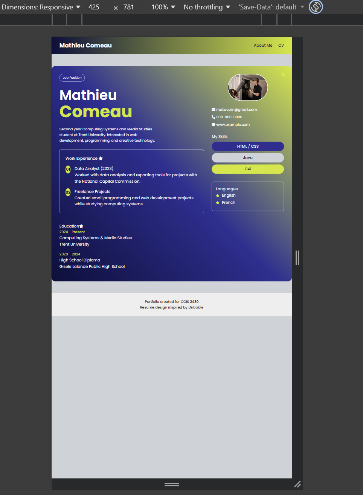

# Assignment #2 Testing Document

- You don't need to include any code in this document, or export it to PDF. This should just be your labelled testing screenshots. Make sure to preview this document in GitHub online to ensure all your images load correctly or there will be marks deducted from your testing section.
- Make sure to put your screenshots into a folder for each question. The only *file* that should be directly in the testing folder is this document (to make it easy for the marker to load)

